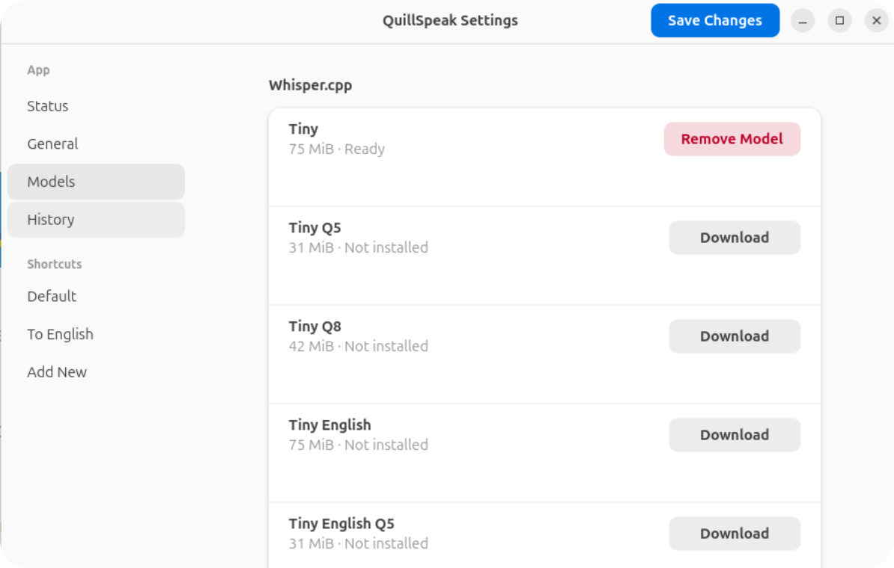

# QuillSpeak

QuillSpeak is a local-first push-to-talk voice transcription app for Linux
desktops.

Hold a trigger, speak, release, and QuillSpeak transcribes your voice with a
local whisper.cpp model. The final text can be copied to the clipboard, passed
through a script, or pasted into the focused app through normal Linux desktop
tools.

<p align="center">
  
</p>

[Documentation](https://ilysenko.github.io/quillspeak/) |
[Releases](https://github.com/ilysenko/quillspeak/releases) |
[Issues](https://github.com/ilysenko/quillspeak/issues) |
[License](LICENSE)

## What It Is For

QuillSpeak is meant for local voice typing on Linux:

- push-to-talk dictation,
- fast transcription into text fields,
- per-shortcut model, language, trigger, and output settings,
- scriptable post-processing such as translation or rewriting,
- clipboard copy and optional paste shortcuts.

It is not a cloud transcription service. Audio is recorded locally and
transcribed locally with downloaded whisper.cpp models.

## Where It Works

QuillSpeak is built for Linux desktop sessions with GTK4 and libadwaita.

- X11: QuillSpeak can capture configured global keyboard shortcuts directly.
- Wayland: use compositor keybindings or an external hotkey tool to call
  `quillspeak trigger`.
- Mixed Wayland/X11 sessions: QuillSpeak uses Wayland-style external triggers.

The app records audio through CPAL and can use PipeWire or PulseAudio audio
hosts depending on the system.

## Install

Download Debian/Ubuntu packages from
[GitHub Releases](https://github.com/ilysenko/quillspeak/releases).

- `quillspeak`: default package with Vulkan whisper.cpp support and CPU
  fallback.
- `quillspeak-cpu`: CPU-only package for simpler systems.

Runtime clipboard and paste features may need:

```sh
sudo apt install wl-clipboard xclip xdotool ydotool
```

Speaker mute while recording may need:

```sh
sudo apt install wireplumber pipewire-bin
```

## Limits

- Linux desktop only.
- Wayland global keyboard capture must be handled by an external hotkey tool.
- Direct text insertion is not implemented; paste uses the system clipboard as
  transport.
- A downloaded whisper.cpp model is required before transcription.
- Do not run the main app with `sudo`.

## Documentation

Start with the full documentation site:

- [Getting Started](https://ilysenko.github.io/quillspeak/getting-started.html)
- [Settings Reference](https://ilysenko.github.io/quillspeak/settings.html)
- [Triggers on X11 and Wayland](https://ilysenko.github.io/quillspeak/triggers.html)
- [Scripts, Clipboard, and Paste](https://ilysenko.github.io/quillspeak/output.html)
- [Troubleshooting](https://ilysenko.github.io/quillspeak/troubleshooting.html)

## Build From Source

Install Debian/Ubuntu build dependencies:

```sh
sudo apt install build-essential pkg-config cmake clang libclang-dev \
  libasound2-dev libpulse-dev libpipewire-0.3-dev \
  libgtk-4-dev libadwaita-1-dev
```

Run from the workspace:

```sh
cargo run -p quillspeak --bin quillspeak
```

Useful checks:

```sh
cargo fmt --all --check
cargo check --workspace
cargo test --workspace
cargo clippy --workspace --all-targets -- -D warnings
git diff --check
```

## License

QuillSpeak is free software under the MIT License. See [LICENSE](LICENSE).
